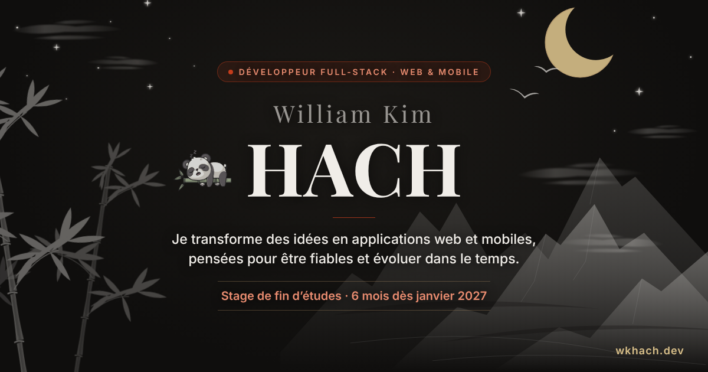

# wkhach.dev — Portfolio de William Kim HACH

Portfolio de développeur full-stack web et mobile, en ligne sur **[wkhach.dev](https://wkhach.dev)**.
Je recherche un **stage de fin d'études de 6 mois à partir de janvier 2027**, en France ou à l'étranger.



## Ce que présente le site

- **Projets** : trois projets mis en avant (Équilibre, XIP Telecom v2, KCD Formes v2), puis les autres réalisations.
  Chaque fiche suit le même fil : besoin, mon rôle, résultat, difficulté résolue, puis les détails techniques.
- **À propos** : mon parcours (reconversion après 4 ans et demi en logistique) et mes compétences.
- **Contact** : formulaire relié à Mailjet, adresse email copiable en un clic.
- **CV** français et anglais téléchargeables, générés à partir de sources versionnées dans [`cv/`](cv/README.md).

## Stack

| | |
|---|---|
| Framework | Next.js 16 (App Router), React 19, TypeScript |
| Styles | Tailwind CSS 4, design tokens (encre, papier washi, vermillon, or) |
| Animations | Framer Motion, CSS, Lottie (panda) |
| Typographie | Playfair Display, Inter, Ma Shan Zheng via `next/font` |
| Email | Mailjet (route API `app/api/contact`) |
| Hébergement | Vercel |

## Choix de conception

- **Paysage à l'encre en SVG** (`components/InkLandscape.tsx`) : le dessin est statique, seules des couches entières
  sont animées en CSS (bambous, nuages, brume, oiseaux, étoiles, feuilles qui tombent). Les animations se mettent
  en pause quand le hero sort de l'écran ou que l'onglet est masqué.
- **Thème clair / sombre** sans flash : un script pose la classe `.dark` avant l'hydratation, et l'état React s'y abonne
  (`useSyncExternalStore`). Changer de thème déclenche un lever / coucher animé du soleil et de la lune.
- **Bilingue FR / EN** : dictionnaires typés dans `lib/i18n`, préférence mémorisée.
- **Accessibilité** : le réglage « réduire les animations » du système est respecté partout (Framer Motion, CSS,
  défilement), contrastes vérifiés en mode sombre, libellés ARIA traduits.
- **SEO** : métadonnées Open Graph, sitemap et robots générés par Next.js.

## Lancer le projet

```bash
npm install
npm run dev      # http://localhost:3002
npm run lint
npm run build
```

Le formulaire de contact a besoin de deux variables d'environnement (dans `.env.local`) :

```bash
MAILJET_API_KEY=...
MAILJET_SECRET_KEY=...
```

## Structure

```
app/            pages, layout, métadonnées, route API contact, sitemap, robots
components/     sections (Hero, Projects, About, Contact), paysage SVG, lanternes, fiches projet
lib/i18n/       textes français et anglais
cv/             sources HTML/CSS des CV (voir cv/README.md)
public/         images des projets, CV en PDF, animations Lottie, icônes
```

## Contact

William Kim HACH · [wkhach.dev](https://wkhach.dev) · [LinkedIn](https://www.linkedin.com/in/william-hach-31117b407/) · hach.william89@outlook.fr
